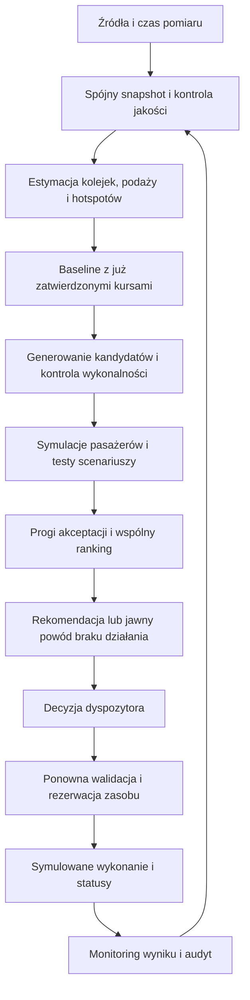

# UrbanFlow — ocena i poprawiony plan procesu decyzyjnego

Data: 2026-09-06. Status: propozycja architektury i plan wdrożenia, bez zmiany kodu aplikacji.

Podstawa: dokument `UrbanFlow_DECISION_ENGINE.md` v1 z Downloads, obecny kod repozytorium i źródła wymienione na końcu. Zalecenia dokumentu wejściowego poddano ocenie; nie potraktowano ich jako poleceń wdrożenia. Poniższa wersja zastępuje jego logikę decyzyjną jako propozycja v2. Wszystkie nowe wartości progowe są parametrami DEMO do kalibracji, nie normami operacyjnymi.

## 1. Opinia

Kierunek jest trafny: wykrywanie deficytu podaży, porównanie z brakiem nowej interwencji, symulowanie wykonalnych wariantów i decyzja dyspozytora. Zachowałbym ten szkielet oraz rozdzielenie symulatora od optymalizatora.

Dokument jest jednak bardziej katalogiem pomysłów niż gotową specyfikacją. Ma 110 sekcji, powtarza reguły i miesza demo z produkcją. Największym ryzykiem jest nadanie pozornej precyzji modelowi, który nie zna kolejek, wysiadania ani rzeczywistej dostępności rezerw. Bardziej złożony algorytm nie naprawi tych braków.

Moja rekomendacja: najpierw jeden poprawny model pasażerów, jedna rezerwa i zamknięty proces zatwierdzenia. Następnie odporność na błędne prognozy i wiele hotspotów. ALNS dopiero po benchmarku wskazującym ograniczenia prostszych metod.

## 2. Co rzeczywiście mamy w projekcie

Ocena na podstawie odczytu kodu, bez uruchamiania aplikacji i testów.

| Obszar | Stan w kodzie | Konsekwencja |
|---|---|---|
| `backend/app/services/decision_engine.py` | Reguła 85%, 120 s, confidence 0.75, headway 420 s | Dobry punkt startowy detektora, jeszcze nie optymalizator |
| Ten sam plik | Stałe: 87 obsłużonych, 624 pasażerominuty, 0.78 peak load; stałe przystanki i pojemność | KPI nie są obecnie wynikiem symulacji |
| `backend/app/services/state_store.py` | Scenariusz przekazuje headway 660 s i dostępność jako bool | Potrzebny model podaży i konkretnych zasobów |
| Ten sam plik | Ruch dodatkowego pojazdu po geometrii, pasażerowie = 0, czas przejazdu 900 s | Animacja nie zastępuje symulatora przepływu pasażerów; przejazd musi uwzględnić wybrany odcinek |
| `backend/app/integrations/realtime_provider.py` | Adapter ZTP, GTFS Static, pozycje i opóźnienia TripUpdates; pojemność i zapełnienie są `None` | Integracja LIVE już istnieje, ale nie dostarcza jeszcze wejść potrzebnych do oceny korzyści |
| `backend/app/integrations/occupancy_provider.py` | Protokół providera i model pomiaru | Brakuje tu konkretnego dostawcy rzeczywistych pomiarów |
| `backend/app/domain/recommendation.py` | OPEN / ACCEPTED / DISMISSED | Brakuje ważności, rewizji, EXPIRED i odwołania do wersji snapshotu |
| `create_dispatch()` w store | Parametry przejazdu przychodzą z requestu; kontrola otwartej rekomendacji i istnienia trasy | Zatwierdzenie powinno odwoływać się do ocenionego wariantu i ponownie sprawdzać wykonalność |
| `backend/app/main.py` | Pętla realtime i pętla animacji | Potrzebna osobna pętla optymalizacji |
| `frontend/components/urban-flow-dashboard.tsx` | Dashboard mapy, pojazdów i śledzenia | Karta decyzji z porównaniem wariantów wymaga osobnego podłączenia |

README backendu jest częściowo nieaktualne: opisuje prawdziwe źródła jako niepodłączone, podczas gdy adapter ZTP i pętla odpytywania są w kodzie. Planowanie należy opierać na implementacji.

## 3. Najważniejsze poprawki względem v1

| Problem w v1 | Poprawka w v2 |
|---|---|
| ETA następnego pojazdu jako koniec problemu (§40) i twarde odrzucanie późniejszej rezerwy | Następny pojazd może być pełny. Koniec problemu określamy z prognozy kolejki i podaży. Przewaga czasowa jest cechą wariantu, a nie uniwersalnym warunkiem wykonalności |
| Zachowanie wszystkich starych gates (§98) | 85% i 420 s to sygnały detekcji, nie obowiązkowa koniunkcja. Duża kolejka może wymagać analizy mimo niższego bieżącego zapełnienia |
| Model wsiadania bez jawnego wysiadania (§17) | Na każdym zdarzeniu: wysiadanie → wolna pojemność → wsiadanie → aktualizacja kolejki i pasażerów w pojeździe |
| `leftBehind` wyznaczane w każdym kroku | Odmowa wejścia istnieje przy odjeździe pojazdu, który obsługuje daną relację i nie ma miejsca; brak kursu w kroku nie oznacza odmowy |
| Zwykły czas czekania plus 2.5 × czas pozostawionych | Rozdzielić czas przed pierwszą odmową i po niej albo jawnie nazwać drugą wagę dodatkową karą. Obecny zapis daje łącznie wagę 3.5 |
| Peak 108% przy symulatorze ograniczającym przyjęcia do capacity | Rozdzielić faktyczne zapełnienie i zapotrzebowanie względem pojemności. Nadwyżka popytu pozostaje w kolejce |
| Preferowanie najkrótszego odcinka | Uwzględnić miejsca docelowe, przesiadkę po krótkim kursie i powrót rezerwy; inaczej krótki kurs sztucznie wygrywa |
| 120 s minimalnego headway traktowane jako bezpieczeństwo | Oddzielić ograniczenia infrastrukturalne operatora od celu regularności. Stała DEMO nie jest parametrem bezpieczeństwa sieci |
| Confidence 86%, mnożenie benefit × confidence i kara uncertainty | Do czasu kalibracji pokazywać jakość danych i zakres scenariuszy, bez pozornej probabilistycznej precyzji i podwójnego karania niepewności |
| Najlepszy wynik, potem test confidence (§58) | Najpierw kwalifikacja wszystkich wariantów. Jeśli najwyższy wynik jest niewiarygodny, rozważyć kolejny, który spełnia warunki |
| Brak jawnego kosztu końca horyzontu | Uwzględnić pozostałe kolejki, niedokończone podróże i pełne zajęcie rezerwy, również po 25. minucie |
| Commit horizon jako ochrona wykonanych decyzji | Każda zatwierdzona interwencja jest zobowiązaniem niezależnie od liczby minut. Zmiana wymaga osobnej operacji |
| ALNS jako przesądzony najlepszy algorytm | Zachować jako hipotezę. Porównać enumerację, greedy, ograniczone przeszukiwanie par i ewentualny solver |

Przykłady liczb w v1 też wymagają korekty: dla podanych wag baseline 1240 + 2.5 × 310 + 0.6 × 480 wynosi **2303**, a nie 2014. Dane demonstracyjne powinny być generowane przez model, nie ręcznie dopasowane do narracji.

## 4. Zakres pierwszej wersji

Jedna rezerwa, jeden kierunek korytarza, kilka przystanków, regularne kursy w horyzoncie i 12–36 wariantów. Przy wielu wykrytych problemach zasób wybieramy we wspólnym rankingu, na jednakowym obszarze i horyzoncie oceny.

Akcje MVP: `NO_NEW_ACTION`, `DISPATCH_EXTRA`, `WAIT_AND_REEVALUATE`, `OBSERVE_ONLY`. Ten ostatni stan oznacza brak danych do rekomendacji, a nie brak problemu. `WAIT` oznacza odłożenie decyzji do kolejnego pomiaru; na MVP nie przypisujemy mu policzonej wartości optymalnej polityki oczekiwania.

Skrócony kurs dopuszczamy tylko dla zatwierdzonego wariantu trasy i jawnego modelu podróży pasażerów. Na demo można ustawić scenariusz, w którym wszyscy obsługiwani pasażerowie jadą do przystanków w tym odcinku.

## 5. Cały proces decyzyjny



| Krok | Reguła | Wynik / zachowanie przy problemie |
|---|---|---|
| 1. Pobranie | Zachować czas pomiaru i odbioru osobno; wykrywać duplikaty, opóźnione zdarzenia i brak pól | Nie odświeżać wieku starego pomiaru samym odczytem |
| 2. Snapshot | Wersjonowany, niezmienny obraz sieci z czasem `asOf`, wersją tras, popytu i polityki | Niespójny zakres trafia do OBSERVE_ONLY |
| 3. Estymacja | Kolejki po kierunku i obsługiwanej relacji, ETA po kolejnych przystankach, wolna pojemność po wysiadaniu | Braki to UNKNOWN lub jawny model, nigdy zero |
| 4. Detekcja | Trwały deficyt podaży LUB przewidywana kolejka/odmowy; trend obliczany dla porównywalnych miejsc na trasie | WATCHING zanim jest wystarczająca historia |
| 5. Baseline | Brak NOWEJ akcji, ale wszystkie już przyjęte działania pozostają | Baseline nie może usuwać tramwaju już wysłanego |
| 6. Kandydaci | Rezerwa × punkt startu × zakończenie × czas; dostępna trasa techniczna i plan powrotu | Odrzucenie z konkretnym reasonCode |
| 7. Symulacja | Ten sam snapshot, popyt, zbiór pasażerów i reguły dla wszystkich wariantów | Błąd modelu blokuje rekomendację, nie zwraca zerowego kosztu |
| 8. Kwalifikacja | Wykonalność, minimalna korzyść, odporność, ograniczenia pogorszenia innych relacji | Osobno lista odrzuconych i lista dopuszczonych |
| 9. Ranking | Największa korzyść netto; przy remisie krótsze zajęcie rezerwy, następnie stabilny identyfikator | Utrzymać aktualny wariant przy niematerialnej różnicy |
| 10. Publikacja | Problem, prognoza bez działania, akcja, koszt, zakres niepewności, alternatywy, termin ważności | Stabilne ID rekomendacji i numer rewizji |
| 11. Akceptacja | Powtórna kontrola świeżości, zasobów, wersji i wykonalności | Zmiana warunków: konflikt i nowa ocena, bez podmiany akcji w tle |
| 12. Wykonanie | Potwierdzony przydział, dojazd, obsługa, powrót, ponowna gotowość | Błąd lub opóźnienie uruchamia ponowną ocenę pozostałej sieci |
| 13. Ocena efektu | Oddzielić obserwowane KPI od modelowanej korzyści względem kontrfaktycznego baseline | Wynik, decyzja operatora i błędy prognozy trafiają do audytu |

Pętla DEMO: co 30 s czasu modelu. LIVE: okresowo i po istotnym zdarzeniu, z ograniczeniem częstotliwości. Jeden przebieg naraz; nowszy snapshot unieważnia stary wynik, jeśli zmienia wykonalność. Obliczenia nie powinny blokować obsługi HTTP/WebSocket.

## 6. Dane — czego potrzebujemy i w jakiej kolejności

| Priorytet | Dane | Skąd / plan pozyskania | Dlaczego |
|---|---|---|---|
| P0 | Kolejność przystanków konkretnego kursu, kalendarz, wariant trasy, czasy | Rozszerzenie obecnego GTFS Static | Sama geometria `(linia, kierunek)` nie rozróżnia wszystkich wariantów |
| P0 | Przewidywane przyjazdy/odjazdy, odwołania i pominięte przystanki | TripUpdates i model ETA, gdy pola są nieobecne | Opóźnienie jednego kursu nie jest headwayem ani kompletną prognozą podaży |
| P0 | Liczba pasażerów, pojemność taboru, czas i jakość pomiaru | DEMO: provider scenariusza; pilot: operator/APC i rejestr taboru | Bez mianownika nie znamy wolnej pojemności |
| P0 | Kolejka początkowa, napływ, wysiadanie / relacje podróży | DEMO: jawny plik scenariusza; pilot: APC, obserwacje terenowe, model popytu | GPS i obłożenie jadącego tramwaju nie określają liczby oczekujących |
| P0 | Rezerwa, lokalizacja, readyAt, motorniczy, kompatybilność, inne przydziały | DEMO: rejestr zasobów; pilot: dyspozytornia | Dostępny pojazd bez obsady nie jest wykonalną interwencją |
| P0 | Dojazd po torach, punkty włączenia i nawrotu, czas powrotu | Lista wariantów potwierdzona przez operatora; DEMO: jawne założenia | Linia na mapie nie dowodzi przejezdności trasy technicznej |
| P0 dla LIVE | Blokady i zakazy ruchu na trasie interwencji | Dane dyspozytorskie, komunikaty i stan infrastruktury | Nieznana przejezdność krytycznego odcinka blokuje rekomendację operacyjną |
| P1 | Historia czasów odcinkowych i postoju, błąd ETA | Archiwum AVL / zdarzeń przystankowych | Realistyczna niepewność dojazdu i bunchingu |
| P1 | Popyt po porze dnia i typie dnia, kolejki po odjazdach | APC i pomiary próbne | Kalibracja modelu oraz wykrywanie systematycznie pomijanych pasażerów |
| P1 | Obsługiwane relacje przez inne linie i przesiadki | GTFS plus zagregowane dane podróży | Ta sama kolejka nie może być liczona osobno na każdej linii |
| P2 | Wydarzenia, godzina ich końca, pogoda, ferie, remonty | Kalendarze i dostawcy zewnętrzni po potwierdzeniu wartości | Korekta popytu; nie zastępuje brakujących danych P0 |

Do operatora skierować konkretną prośbę o próbkę zsynchronizowanych danych: kursy i pojazdy, wejścia/wyjścia, gotowość rezerwy i obsady, dozwolone manewry oraz decyzje dyspozytorów. Zakres próbki powinien obejmować szczyt, okres spokojny i zakłócenie. Na start wystarczą zagregowane liczby, bez identyfikacji pasażerów.

Każda estymata potrzebuje `source`, `measuredAt`, `receivedAt`, `methodVersion`, informacji o brakach i zakresu niepewności, jeśli jest dostępny. Jakość danych rozdzielamy na pozycję, occupancy, popyt, ETA i zasoby. Jedna średnia confidence nie może ukryć nieznanej dostępności motorniczego.

GTFS-RT przewiduje opcjonalne pola occupancy; sam standard nie gwarantuje ich obecności w konkretnym feedzie. Nie należy przeliczać kategorii occupancy na arbitralne procenty. Obecny adapter UrbanFlow ustawia occupancy na UNKNOWN; nie sprawdzono tu zawartości binarnych feedów pod kątem tych pól. [Specyfikacja GTFS-RT](https://gtfs.org/documentation/realtime/reference/)

Katalog ZTP jest punktem wejścia do danych miejskich; nie jest dowodem dostępności danych o kolejkach, obsadzie i rezerwach. [Katalog ZTP](https://gtfs.ztp.krakow.pl/)

## 7. Model pasażerów i metryk

Symulator zdarzeniowy: przybycie pasażerów, przyjazd pojazdu, wysiadanie, wsiadanie, odjazd. MVP może używać deterministycznych kohort pasażerów zamiast indywidualnych osób. Kohorta zawiera przystanek, czas przybycia, cel/obsługiwane kursy, liczbę osób i historię odmów.

Na zdarzeniu obsługi przystanku:

```text
Q_before = Q_previous + arrivals_since_previous_event
L_after_alighting = L_before - alighting
free = max(0, operationalCapacity - L_after_alighting)
boarded = min(eligibleWaiting, free)
L_after = L_after_alighting + boarded
Q_after = Q_before - boarded
```

`eligibleWaiting` uwzględnia kierunek, cel i możliwość skorzystania z krótkiego kursu. Wysiadanie nie może przekraczać liczby osób w pojeździe. Jeśli dwie linie obsługują tę samą kohortę, pierwsza zabiera pasażerów ze wspólnej kolejki.

`deniedBoardingEvents` zwiększamy o liczbę chętnych, którzy nie weszli z braku miejsca podczas tego odjazdu. `uniqueDeniedPassengers` zwiększamy tylko przy pierwszej odmowie danej kohorty/osoby. Ta sama osoba może mieć trzy zdarzenia odmowy, ale pozostaje jedną osobą. Osoba, której cel nie jest obsługiwany przez kurs, nie jest odmową z powodu pojemności.

Czas oczekiwania to całka liczby oczekujących po czasie, obliczana z rzeczywistych chwil napływu. `W0` oznacza pasażerominuty przed pierwszą odmową, `W1` po pierwszej odmowie; `W = W0 + W1`. Nie kończymy naliczania czasu tylko dlatego, że pasażer nie został obsłużony przed końcem okna.

Stan początkowy pasażerów musi być taki sam we wszystkich wariantach. Nowy tramwaj nie przenosi osób z już jadącego pełnego tramwaju. Wysokie zapełnienie pojazdu przed rozpoczęciem interwencji nie może magicznie zniknąć z maksimum całego horyzontu.

Oddzielne metryki:

- `onboardLoadRatio`: liczba osób / operacyjna pojemność; model nie dopuszcza nowych przyjęć ponad limit.
- `demandCapacityRatio`: zapotrzebowanie / dostępna pojemność, może przekroczyć 1.
- `queueAtHorizon`, liczba i czas niedokończonych podróży.
- `waitingPassengerMinutesSaved`: różnica W, bez wag polityki.
- `generalizedCostReduction`: różnica funkcji celu, inna jednostka interpretacyjna.

Jeżeli źródło raportuje obłożenie ponad 100%, zachować pomiar i oznaczyć naruszenie/model mismatch; nie usuwać nadmiarowych pasażerów. Reguła przyjęć nie wpuszcza kolejnych do czasu zwolnienia miejsc. Specyfikacja GTFS-RT dopuszcza raportowanie occupancy powyżej 100%, co nie jest pozwoleniem na planowanie przekroczenia limitu. [Definicja occupancy](https://gtfs.org/documentation/realtime/reference/#message-vehicleposition)

Średnie oczekiwanie porównywać dla tej samej kohorty popytu i z jawną obsługą podróży niedokończonych. Średnia tylko po osobach, które zdążyły wsiąść, ukrywa najbardziej poszkodowanych.

## 8. Funkcja celu i wybór wariantu

Proponowany zapis kosztu całego planu P w scenariuszu s:

```text
J(P, s) = W0 + alpha * W1 + beta * Crowding
        + gamma * AdditionalInVehicleAndTransferMinutes
        + k_deadhead * DeadheadMinutes
        + k_service * ExtraServiceMinutes
        + k_return * ReturnMinutes
        + k_ready * RecoveryMinutes
        + ReserveOpportunityCost(P)
        + TerminalPassengerCost(P, s)
```

Wagi przeliczają składniki na uogólnione pasażerominuty. `alpha = 2.5` oznacza łączną wagę czasu po odmowie, nie dodatkowe 2.5 ponad już policzoną minutę. `Crowding` należy zdefiniować jawnie, np. całka `max(0, onboard - comfortCapacity)` po czasie. Czas przesiadkowego oczekiwania pozostaje w W; dodatkowy składnik obejmuje wyłącznie niepoliczone wcześniej przejazdy, dojście i ustaloną uciążliwość wymuszonej przesiadki.

Pełny koszt zajęcia rezerwy: przygotowanie, dojazd, kurs, powrót i odzyskanie gotowości. Koszt zasobu naliczamy również po końcu horyzontu pasażerskiego. `ReserveOpportunityCost` dotyczy utraty przyszłej dostępności; nie może ponownie naliczać tej samej straty na innych obecnie ocenianych hotspotach.

`TerminalPassengerCost` szacuje dalszy koszt już oczekujących i niedokończonych podróży po końcu okna. W MVP można wykonać wspólną kontynuację symulacji dla kohort obecnych do H, bez generowania nowych decyzji. Przy limicie kontynuacji raportować resztę i wykonać test wrażliwości horyzontu, zamiast zakładać zerowy koszt.

Horyzont początkowy: 25 min. Sprawdzić także 20 i 35 min na zestawie testowym. Jeśli ranking istotnie się odwraca, poprawić model końca horyzontu lub rozszerzyć zakres. Sam rolling horizon nie usuwa krótkowzroczności.

```text
B = plan już zatwierdzony
deltaJ(a, s) = J(B, s) - J(B + a, s)
```

W MVP oceniamy scenariusz bazowy i kilka testów wrażliwości: niższy/wyższy popyt oraz opóźniony dojazd rezerwy. Przykładowe ±20% i +2 min są założeniami demo. Warianty i baseline muszą dostać identyczny scenariusz zewnętrzny. Testów wrażliwości nie nazywamy p10/p90 bez rozkładu prawdopodobieństwa i kalibracji.

Polityka DEMO do jawnej konfiguracji:

1. Odrzuć niewykonalne akcje.
2. Dla każdego kandydata sprawdź `deltaJ_base >= 150` uogólnionych pasażerominut, `waitingPassengerMinutesSaved >= 150` i `min(deltaJ_stress) >= 0`.
3. Sprawdź limity pogorszenia innych obsługiwanych relacji i nieprzekraczalne ograniczenia zasobów. Limity ustala operator; demo ma jawny profil scenariusza.
4. Spośród dopuszczonych wybierz największe `deltaJ_base`; remisy rozstrzygaj krótszym zajęciem rezerwy i stabilnym kluczem.
5. Jeżeli brak dopuszczonych: NO_NEW_ACTION dla braku sensownej korzyści, WAIT dla wyniku granicznego z realną szansą doprecyzowania, OBSERVE_ONLY dla braków wejścia.

Próg surowych oszczędności W jest dodatkowym warunkiem polityki MVP i może odrzucić działanie poprawiające głównie komfort. W pilotażu operator powinien zdecydować, czy chce takiej restrykcji. Nie dodawać równocześnie arbitralnego mnożnika confidence i kary uncertainty za ten sam błąd prognozy.

Przykład wyłącznie rachunkowy: W0=930, W1=310, Crowding=480 daje koszt pasażerski 1993 przy alpha=2.5 i beta=0.6. Dla wariantu W0=562, W1=54, Crowding=125 koszt wynosi 772. Różnica W to 1240−616=624, różnica kosztu pasażerskiego to 1221. Dopiero po odjęciu kosztu zasobu i różnicy kosztu końcowego otrzymujemy deltaJ. Nie są to wyniki obecnej aplikacji.

## 9. Wykonalność, odporność i stabilność

Ograniczenia twarde: gotowość pojazdu i obsady, zatwierdzona przejezdna trasa, zgodność taboru, wykonalny nawrót, brak kolizji przydziałów czasowych i ograniczenia infrastruktury. Naruszenie nie może być wykupione wysokim benefitem.

Regularność odstępów to osobny cel jakościowy. Kontrolować ETA przed i za rezerwą na kolejnych przystankach, nie tylko w miejscu włączenia. Postój zależny od liczby wsiadających/wysiadających powinien wpływać na kolejne ETA. W demo można przyjąć uproszczone, opisane parametry postoju.

Nie odrzucać automatycznie rezerwy docierającej po najbliższym kursie. Przykład: kolejka 100, najbliższy kurs za 4 min ma 10 wolnych miejsc, rezerwa za 6 min. Taki wariant wymaga symulacji mimo późniejszego przyjazdu.

Persistence opierać na czasie zdarzeń i pokryciu historią; dwa wysokie odczyty oddzielone długą luką nie dowodzą ciągłego przeciążenia. Parametry maksymalnej luki i świeżości ustalić według częstotliwości źródła. DEMO i LIVE mają osobne profile, a dane syntetyczne pozostają oznaczone jako syntetyczne.

Hotspot to epizod na odcinku i kierunku, ze stabilnym ID; aktualizacja czasu nie tworzy nowego problemu. Dodać histerezę: np. wykrywanie przez 120 s, wygaszenie po 90 s trwałej poprawy w DEMO. Zmiana wariantu wymaga materialnej poprawy wyniku; pogorszenie wykonalności unieważnia go natychmiast. Cooldown po odrzuceniu dotyczy konkretnego epizodu i powodu, nie bezwarunkowo całej linii.

Przy braku zasobów problem nadal jest widoczny. Kod powodu powinien rozróżniać `NO_RESERVE`, `NO_DRIVER`, `UNKNOWN_TRACK_FEASIBILITY`, `DATA_INSUFFICIENT`, `INSUFFICIENT_BENEFIT` i `MODEL_TIMEOUT`.

## 10. Rekomendacje i wykonanie

Trzy niezależne maszyny stanów:

```text
Hotspot: WATCHING → ACTIVE → RECOVERING → RESOLVED
Recommendation: OPEN → ACCEPTED | DISMISSED | EXPIRED | SUPERSEDED
Dispatch: RESERVED → PREPARING → DEADHEAD → IN_SERVICE → RETURNING → COMPLETED
```

Niepowodzenie wykonania ma stan FAILED. CANCELLED oznacza potwierdzone odwołanie; dla pojazdu już jadącego nie wolno przez zmianę statusu od razu zwolnić zasobu. Potrzebny jest plan zakończenia/powrotu i potwierdzony moment gotowości. W DEMO reset jest osobną operacją odtwarzającą cały świat.

Akceptacja wskazuje `recommendationId`, `revision`, `candidateId` i `idempotencyKey`. Backend bierze parametry trasy i zasobu z ocenionego kandydata. Zmiana startu lub pojemności przez użytkownika tworzy nowy wariant do przeliczenia.

W jednej transakcji: sprawdzić ważność i rewizję, potwierdzić stan zasobu, zarezerwować go w przedziale czasu, zapisać akceptację i utworzyć dispatch. Powtórzenie tego samego klucza zwraca poprzedni wynik; konkurencyjna akceptacja tej samej rezerwy dostaje konflikt. W demo wystarczy pojedynczy proces i blokada, przed pilotażem potrzebna trwałość i transakcyjność.

Rekomendacja zawiera `validUntil`; przykładowe 90 s dotyczy DEMO. Upływ TTL, utrata zasobu lub zmiana wykonalności wygaszają OPEN. Zatwierdzone działania zawsze wchodzą do następnego baseline. Nie przechodzą ponownie przez automatyczne wygaszanie rekomendacji.

## 11. Architektura i kontrakty

Nowe komponenty w `backend/app/decision/`: `models`, `snapshot_builder`, `hotspot_detector`, `candidate_generator`, `constraints`, `simulator`, `objective`, `optimizer`, `reconciler`. Prognoza popytu może początkowo być prostym providerem scenariusza. Dotychczasowy DecisionEngine pełni rolę adaptera podczas migracji.

Minimalne modele:

| Model | Najważniejsze pola |
|---|---|
| NetworkSnapshot | id, asOf, scope, vehicles, tripPatterns, stopEvents, passengerCohorts, reserves, committedPlan, sourceQuality, versions |
| Hotspot | stableId, corridor, direction, segment, episodeStart, queueForecast, shortage, evidence, state |
| Reserve | id, capacity, location, readyAt, driverAvailable, compatibility, availabilityIntervals |
| DispatchCandidate | id, reserveId, tripPatternId, start/end, prepareAt, departAt, firstImpactAt, returnReadyAt |
| Evaluation | snapshotId, candidateId, constraints, baselineKpis, candidateKpis, deltaJ, stressResults, rejectionReasons |
| Recommendation | id, revision, hotspotIds, candidateId, runId, validUntil, status, explanation |
| OptimizationRun | snapshot/config/model versions, seed/scenarios, candidate counts, timing, result, completeness |

Proponowane API: `GET /decision/hotspots`, `POST /decision/optimize` dla demo, `GET /decision/runs/{id}`, `GET /recommendations/{id}/alternatives`. Zatwierdzenie przez obecny mock-dispatch po rozszerzeniu kontraktu o oceniony wariant i rewizję. Nie dodawać endpointu realnego dispatchu w tym etapie.

Karta UI: objaw i wiek danych → prognoza bez nowej akcji → rezerwa, punkt i czas włączenia → oszczędności, odmowy, zajęcie rezerwy → scenariusze niepewności → alternatywy → „Uruchom symulację”. Rozróżniać czas wyjazdu z rezerwy od czasu rozpoczęcia obsługi. Widocznie oznaczać estymaty i DEMO; nie wyświetlać „86% pewności” ze stałej.

Zegar symulacji wspólny dla ruchu, popytu, TTL i pętli decyzji. Seed, konfiguracja i snapshot pozwalają powtórzyć wynik. Replay nie powinien zależeć od `utc_now()` wewnątrz symulatora.

## 12. Kolejność wdrożenia

Szacunki w osobodniach dla obecnego repo, przy znanych danych DEMO i sprawnej pracy zespołu. To orientacyjne widełki, nie gwarancja terminu; pozyskanie danych operatora poza nimi.

| Etap | Praca | Warunek odbioru | Nakład |
|---|---|---|---|
| A | Uzgodnić jednostki, zakres, scenariusz, model pasażerów i zasobu | Plik scenariusza zawiera kolejki, przyjazdy, wysiadanie, rezerwę i dojazd | 0.5–1 dnia |
| B | Snapshot i wspólny zegar, baseline bez nowej akcji | Ręcznie policzony przypadek zgadza się z modelem; historia i dane wejściowe odtwarzalne | 1–2 dni |
| C | Symulacja dodatkowego kursu | Zachowanie liczby pasażerów, pojemność, dojazd i powrót; KPI wyliczane | 1–2 dni |
| D | Generator, constraints, koszt, ranking i scenariusze | Warianty mają breakdown; dopuszczony drugi kandydat może wygrać po odrzuceniu pierwszego | 1–1.5 dnia |
| E | Rolling horizon, TTL, idempotencja, rezerwacja zasobu | Brak duplikatów i podwójnego użycia rezerwy; zatwierdzony kurs pozostaje w baseline | 1–2 dni |
| F | UI i spięcie animacji z wynikiem symulatora | Karta przed/po i top 3; pojazd jedzie po ocenionym odcinku | 1–2 dni |
| G | Scenariusze regresji, benchmark, dokumentacja demo | Powtarzalne wyniki i brak twardo wpisanych korzyści | 0.5–1 dnia |

Łącznie orientacyjnie 6–11.5 osobodnia. Wersja hackathonowa wymaga ograniczenia zakresu: jedna rezerwa, jeden korytarz, syntetyczny popyt, kilka wariantów, prosty UI. Deklaracji „pełny model w 2–3 godziny” z v1 nie przyjmowałbym dla obecnego kodu, ponieważ brakuje symulatora kolejek, a istniejąca symulacja jest animacją.

Kolejny etap pilotażu: rzeczywiste dane rezerw/obsady, podłączenie occupancy, archiwizacja, shadow mode i kalibracja prognoz. Przed użyciem operacyjnym: uwierzytelnienie dyspozytora, trwały audyt, obsługa awarii i potwierdzenia stanu wykonania. Przejście etapów zależy od jakości danych i wyników walidacji, nie tylko upływu czasu.

## 13. Testy i kryteria jakości

| Przypadek | Oczekiwane zachowanie |
|---|---|
| Brak pasażerów | Zero korzyści pasażerskiej, brak wysłania rezerwy |
| Wysiadanie zwalnia miejsca | Kolejka obsłużona zgodnie z wolną pojemnością po wysiadaniu |
| Jedna osoba pominięta przez 3 pełne pojazdy | 3 zdarzenia odmowy, 1 unikalny pasażer, czas czekania policzony raz |
| Następny pojazd za 4 min, wolne 10 miejsc, kolejka 100 | Rezerwa za 6 min nie jest odrzucana tylko z powodu ETA |
| Pełny pojazd już jedzie | Dodatkowy tramwaj nie usuwa jego pasażerów ani historycznego peak |
| Krótki kurs nie obsługuje celu podróży | Brak fikcyjnej obsługi; pasażer czeka albo ma policzony koszt przesiadki |
| Dwie linie mogą zabrać tę samą kolejkę | Osoby i korzyści nie są dublowane |
| Najwyższy deltaJ nie przechodzi testu odporności | Rozważony kolejny dopuszczony kandydat |
| Długa luka w pomiarach | Brak dowodu trwałego przeciążenia z samych dwóch końcowych punktów |
| Dwa jednoczesne zatwierdzenia jednej rezerwy | Dokładnie jedna skuteczna rezerwacja |
| Ten sam request wysłany ponownie | Ten sam dispatch, bez ponownego zajęcia zasobu |
| Akceptacja wygasłej rewizji | Konflikt i ponowne przeliczenie |
| Następna iteracja po akceptacji | Istniejąca akcja w baseline, bez automatycznego cofnięcia |
| Zakończenie kursu bez powrotu | Rezerwa nie jest jeszcze AVAILABLE |
| Zmiana horyzontu 20/25/35 min | Uzasadniona stabilność rankingu lub jawne wykrycie wrażliwości |
| Przekroczenie budżetu obliczeń | Jawny timeout/niepełny ranking, nigdy twierdzenie o sprawdzeniu wszystkich opcji |

Budżet początkowy: zmierzyć p95 < 2 s dla ustalonej liczby pojazdów, przystanków, 36 kandydatów i scenariuszy na docelowej maszynie. To cel inżynierski do sprawdzenia. Przy częściowym wyniku można pokazać najlepszy kompletnie zweryfikowany wariant z etykietą „niepełne przeszukanie”; brak takiego wariantu oznacza brak rekomendacji.

Walidacja nie może polegać wyłącznie na tym samym symulatorze, który wybiera działania. Potrzebne ręczne mikroprzykłady, niezależne pomiary i replay okresów niewykorzystanych do kalibracji. Podział danych według dni i zdarzeń; prognozy nie mogą korzystać z przyszłych obserwacji dostępnych dopiero po decyzji.

W shadow mode obserwujemy tylko jedną rzeczywistą trajektorię. Nie znamy faktycznego świata „bez interwencji”, jeżeli dyspozytor ją wykonał. Raportować oddzielnie błąd prognozy ETA/kolejki, zmierzone wyniki i modelowaną oszczędność. Porównania z podobnymi okresami lub kontrolowany pilotaż mogą pomóc w ocenie efektu, ale acceptance rate nie dowodzi skuteczności.

## 14. Ulepszenia po MVP

Najpierw poprawić model ETA, popytu i jakości danych. Następnie wprowadzić wspólny ranking kilku hotspotów i wielu rezerw. Dla dwóch rezerw warto porównać greedy z enumeracją wykonalnych par: zachłanny wybór może zużyć jedyną rezerwę kompatybilną z drugim problemem.

Przykład: R1→A daje 100, R1→B daje 90, R2→A daje 95, R2 nie może obsłużyć B. Greedy bierze R1→A=100; przy niezależnych efektach lepsza para daje 185. W rzeczywistym modelu wynik pary zawsze ponownie symulujemy.

Nowe akcje, takie jak regulacja odjazdu czy przetrzymanie regularnego pojazdu, mogą być tańsze od rezerwy, ale wymagają osobnych ograniczeń i policzenia strat pasażerów już jadących. Przed ich dodaniem nie deklarować, że wybrana rezerwa jest najlepszą możliwą interwencją w ogóle — tylko najlepszą z ocenionego zbioru.

Fairness oprzeć na długim oczekiwaniu, powtarzalnym deficycie obsługi i limitach pogorszenia poszczególnych relacji. Nie przyznawać bonusu jedynie za czas od ostatniego dispatchu: linia bez potrzeby interwencji nie powinna z tego powodu zdobywać priorytetu.

ALNS, MILP/CP-SAT lub inna metoda mają sens, gdy rozszerzona przestrzeń planów przekracza budżet obliczeń albo prostszy algorytm traci istotną korzyść w benchmarku. Wszystkie metody powinny używać tego samego symulatora, ograniczeń i zestawu testów. „Najlepszy z przetestowanych” nie oznacza globalnego optimum.

## 15. Źródła i granice wniosków

Analiza lokalna obejmuje dokument v1, `UrbanFlow_IMPLEMENTATION_PLAN.md`, wskazane moduły backendu, istniejące testy reguł i dashboard frontendu. Nie przeprowadzono pomiaru skuteczności na danych miejskich ani audytu wszystkich komponentów aplikacji.

Rolling horizon jest uzasadnionym wzorcem sterowania. Praca Gkiotsalitis i van Berkum dotyczy dostosowania odjazdów autobusów i regularności, a nie dowodu skuteczności dispatchu rezerwowych tramwajów w Krakowie. [University of Twente: An exact method for the bus dispatching problem in rolling horizons](https://research.utwente.nl/en/publications/an-exact-method-for-the-bus-dispatching-problem-in-rolling-horizo/)

Praca Gaborit i współautorów dotyczy ALNS z operatorami MILP dla układania rozkładów autobusowych. Wspiera rozważenie takiej rodziny metod, ale nie przesądza wyboru RH-ALNS dla UrbanFlow. [DTU: Optimisation of bus timetables](https://orbit.dtu.dk/en/publications/optimisation-of-bus-timetables-an-adaptive-large-neighbourhood-se/)

Pozostałych ogólnych odwołań bibliograficznych z v1 nie wykorzystano jako dowodów. Proponowane progi, schemat modułów i etapy są oceną projektową dostosowaną do obecnego repozytorium.
