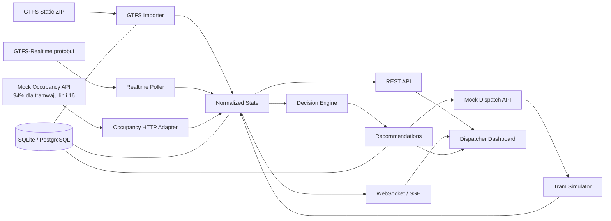
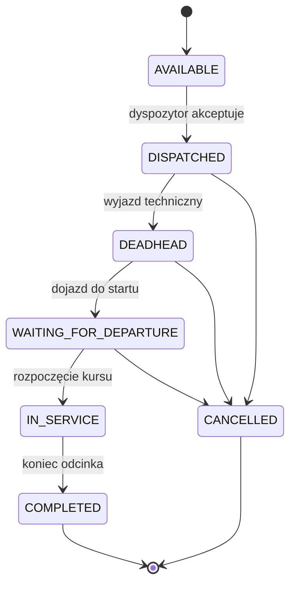

# UrbanFlow — kompletny plan implementacji

> System wspomagania dyspozytora komunikacji miejskiej, który łączy pozycje tramwajów w czasie rzeczywistym z informacją o zapełnieniu, wykrywa przeciążone kursy i pozwala zasymulować wysłanie dodatkowego tramwaju.

**Wersja dokumentu:** 1.0  
**Kontekst:** MVP na hackathon HackYeah / zadanie Smart City  
**Założenie:** podczas demo zapełnienie pojazdów jest dostarczane przez osobne, mockowane Occupancy API. Kamera, ESP32 i model Computer Vision nie należą do zakresu tego MVP. Docelowo ten sam kontrakt może obsłużyć prawdziwy system APC.  
**Tryb systemu:** narzędzie rekomendacyjne z decyzją człowieka, a nie autonomiczne sterowanie transportem publicznym.

---

## 1. Streszczenie projektu

UrbanFlow składa się z czterech głównych elementów:

1. Pobiera rzeczywiste pozycje krakowskich tramwajów z GTFS i GTFS-Realtime.
2. Łączy pozycję każdego pojazdu z danymi o jego zapełnieniu.
3. Wykrywa utrzymujące się przeciążenie i proponuje interwencję dyspozytorską.
4. Po zaakceptowaniu rekomendacji uruchamia symulację dodatkowego tramwaju, pokazuje go na tej samej mapie i oblicza przewidywany efekt interwencji.

Najważniejszy scenariusz demonstracyjny:

```text
Rzeczywiste tramwaje na mapie
        ↓
Mock Occupancy API wysyła dla wybranego tramwaju linii 16 pomiar 94%
        ↓
Backend łączy pomiar z prawdziwą pozycją tego pojazdu
        ↓
System wykrywa przeciążenie na kilku kolejnych pomiarach
        ↓
Powstaje rekomendacja wysłania dodatkowego tramwaju
        ↓
Dyspozytor klika „Uruchom symulację”
        ↓
Na mapie pojawia się wyraźnie oznaczony pojazd SIM-TRAM-01
        ↓
System porównuje KPI „bez interwencji” i „po interwencji”
```

---

## 2. Problem, który rozwiązujemy

Operator transportu publicznego może posiadać osobno:

- pozycje GPS pojazdów,
- rozkład jazdy,
- pomiary napełnienia,
- dane historyczne,
- informacje o dostępności taboru.

Sama obecność tych danych nie daje jeszcze dyspozytorowi odpowiedzi na najważniejsze pytanie:

> „Gdzie właśnie powstaje przeciążenie, czy sytuacja będzie się pogarszać i jaka wykonalna interwencja da największy efekt?”

UrbanFlow jest warstwą integracji i wsparcia decyzji. Nie zastępuje istniejących systemów GPS, liczników pasażerów ani dyspozytora.

---

## 3. Cel MVP

Po ukończeniu MVP użytkownik powinien móc:

- zobaczyć aktualnie jadące tramwaje na mapie Krakowa,
- filtrować je po linii i statusie zapełnienia,
- otworzyć szczegóły konkretnego pojazdu,
- zobaczyć jego zapełnienie, opóźnienie, kierunek i aktualność danych,
- otrzymać rekomendację po wykryciu trwałego przeciążenia,
- zaakceptować rekomendację,
- zobaczyć zasymulowany dodatkowy tramwaj jadący po prawdziwej trasie,
- porównać przewidywane KPI przed interwencją i po niej,
- przełączyć aplikację w deterministyczny tryb demonstracyjny.

### 3.1. Poza zakresem MVP

W czasie hackathonu nie implementujemy:

- produkcyjnego modelu Computer Vision,
- przesyłania lub przechowywania obrazu z kamer,
- automatycznego kontaktowania się z motorniczymi,
- realnego wysyłania pojazdu z zajezdni,
- pełnego systemu układania rozkładów jazdy,
- optymalizacji całej sieci transportowej,
- aplikacji pasażerskiej,
- rozliczeń biletowych,
- uczenia modelu predykcyjnego na nieistniejących danych historycznych.

Te elementy mogą zostać pokazane na roadmapie rozwoju, ale nie powinny zabierać czasu potrzebnego do stworzenia spójnego demo.

---

## 4. Kryteria sukcesu

### 4.1. Kryteria produktu

- Mapa ładuje rzeczywiste tramwaje z Krakowa.
- Pojazdy przesuwają się płynnie, mimo że źródło danych aktualizuje pozycje skokowo.
- Każdy pojazd posiada jednoznaczny status: `LIVE`, `STALE`, `OFFLINE` albo `SIMULATION`.
- Zapełnienie jest widoczne przez kolor, wartość procentową i opis tekstowy.
- System generuje rekomendację tylko po spełnieniu wszystkich zdefiniowanych warunków.
- Symulowany tramwaj korzysta z tej samej reprezentacji danych i komponentu mapy co pojazd rzeczywisty.
- Demo nie zależy w 100% od dostępności zewnętrznych serwerów.

### 4.2. Kryteria techniczne

- Backend nie zwraca błędu całej aplikacji, gdy jedno źródło danych jest niedostępne.
- Dane starsze niż przyjęty próg nie są prezentowane jako aktualne.
- Wszystkie dane czasu są przechowywane w UTC i prezentowane w strefie `Europe/Warsaw`.
- Identyfikatory pojazdu i kursu są zachowywane przez całą ścieżkę integracji.
- Symulacja jest jednoznacznie oznaczona; nie można pomylić jej z prawdziwym pojazdem.
- Najważniejszy scenariusz demo posiada test integracyjny lub skrypt smoke-test.

### 4.3. Kryteria prezentacji hackathonowej

W ciągu 3 minut zespół potrafi pokazać:

1. Prawdziwe dane z miasta.
2. Wykrycie konkretnego problemu.
3. Rekomendację możliwą do zrozumienia przez człowieka.
4. Decyzję dyspozytora.
5. Widoczny efekt na mapie.
6. Mierzalną różnicę w KPI.

---

## 5. Źródła danych

### 5.1. Krakowskie GTFS

Katalog danych ZTP Kraków:

- [katalog GTFS ZTP Kraków](https://gtfs.ztp.krakow.pl/)
- statyczny rozkład tramwajowy: `https://gtfs.ztp.krakow.pl/GTFS_KRK_T.zip`
- pozycje pojazdów: `https://gtfs.ztp.krakow.pl/VehiclePositions_T.pb`
- aktualizacje kursów i opóźnienia: `https://gtfs.ztp.krakow.pl/TripUpdates_T.pb`
- komunikaty: `https://gtfs.ztp.krakow.pl/ServiceAlerts_T.pb`

Format pozycji pojazdów opisuje dokumentacja [GTFS-Realtime Vehicle Positions](https://gtfs.org/documentation/realtime/feed-entities/vehicle-positions/).

### 5.2. Co daje GTFS Static

Plik ZIP należy pobierać podczas startu systemu, raz dziennie albo ręcznie przed demo. Najważniejsze pliki:

| Plik | Zastosowanie |
|---|---|
| `routes.txt` | numery, nazwy i kolory linii |
| `trips.txt` | połączenie kursu z linią, kierunkiem i `shape_id` |
| `stops.txt` | współrzędne oraz nazwy przystanków |
| `stop_times.txt` | kolejność przystanków dla kursu |
| `shapes.txt` | geometria trasy używana także przez symulator |
| `calendar.txt` | bazowe dni kursowania |
| `calendar_dates.txt` | wyjątki kalendarza |

### 5.3. Co daje GTFS-Realtime

| Feed | Zastosowanie |
|---|---|
| `VehiclePositions_T.pb` | bieżąca pozycja, kierunek, identyfikator pojazdu i kursu |
| `TripUpdates_T.pb` | opóźnienia, przewidywane czasy przyjazdu i odjazdu |
| `ServiceAlerts_T.pb` | utrudnienia i komunikaty, opcjonalnie w MVP |

### 5.4. Mockowane Occupancy API

W demie informacja, że tramwaj linii 16 osiągnął 94% zapełnienia, musi przyjść przez osobny serwis HTTP `mock-occupancy-api`. Nie wpisujemy tej wartości w frontendzie i nie dodajemy jej bezpośrednio do stanu dashboardu.

Backend UrbanFlow korzysta z adaptera `OccupancyProvider`, który odpytuje mock dokładnie tak, jak w przyszłości odpytywałby prawdziwy system APC. Dzięki temu po hackathonie można wymienić adres i autoryzację API bez zmiany logiki mapy, rekomendacji ani symulatora.

Podstawowy endpoint mocka:

```http
GET /v1/occupancy?vehicleIds=2184,2371
Authorization: Bearer demo-token
```

Przykładowa odpowiedź:

```json
{
  "measurements": [
    {
      "vehicleId": "2184",
      "tripId": "trip-2026-09-06-16-1320",
      "passengerCount": 190,
      "capacity": 202,
      "loadFactor": 0.94,
      "confidence": 0.91,
      "measuredAt": "2026-09-06T13:24:10Z",
      "source": "MOCK_APC"
    }
  ]
}
```

Mock zwraca serię pomiarów dla tego samego `vehicleId`, np. 82%, 87%, 91%, 94%, a następnie utrzymuje 94% przez wymagany czas. Pozwala to przejść przez regułę trwałego przeciążenia zamiast wygenerować alert po jednym sztucznym skoku.

Aktywacja scenariusza:

```http
POST /v1/scenarios/line-16-overload/activate
Content-Type: application/json
```

```json
{
  "targetVehicleId": "2184",
  "targetTripId": "trip-2026-09-06-16-1320",
  "routeShortName": "16",
  "simulationSpeed": 20
}
```

Backend najpierw wybiera rzeczywisty, aktywny pojazd linii 16 z GTFS-RT, a następnie przekazuje jego `vehicleId` i `tripId` do mockowanego API. Dzięki temu pomiar 94% zostaje przypisany do pojazdu, który naprawdę istnieje na mapie w danym momencie.

Minimalne wymagane pola:

- `vehicleId` — podstawowy klucz łączenia z GTFS-RT,
- `measuredAt` — konieczny do wykrywania starych danych,
- `loadFactor` albo para `passengerCount` + `capacity`,
- `confidence` — jakość pomiaru,
- opcjonalny `tripId` — dodatkowa kontrola zgodności.

Jeżeli prawdziwe API używa innego identyfikatora niż GTFS-RT, konieczna jest tabela mapowania. Nie wolno zakładać, że samo dopasowanie po numerze linii wystarczy.

---

## 6. Architektura systemu

### 6.1. Architektura logiczna



`mock-occupancy-api` jest test double zewnętrznego systemu APC, a nie kolejnym modułem logiki biznesowej UrbanFlow. Dashboard komunikuje się wyłącznie z backendem UrbanFlow; nie pobiera zapełnienia bezpośrednio z mocka.

### 6.2. Zasada najważniejsza

Prawdziwy i symulowany tramwaj mają ten sam model `VehicleState`. Frontend nie posiada osobnego, prowizorycznego komponentu symulacji. Różnią się tylko polami:

```json
{
  "source": "GTFS_RT",
  "isSimulation": false
}
```

lub:

```json
{
  "source": "SIMULATOR",
  "isSimulation": true
}
```

To upraszcza frontend, testy i dalszą integrację.

### 6.3. Rekomendowany stos technologiczny

| Warstwa | Technologia | Uzasadnienie |
|---|---|---|
| Backend | Python 3.12 + FastAPI | szybkie API, WebSocket, łatwa obsługa GTFS i logiki danych |
| GTFS-RT | `gtfs-realtime-bindings` | oficjalna struktura protobuf dla Pythona |
| Walidacja | Pydantic | jeden kontrakt danych w całym backendzie |
| Frontend | React + TypeScript + Vite | szybki start i prosty development |
| Mapa | MapLibre GL JS | płynne markery, warstwy i geometrie tras bez zależności od płatnego dostawcy |
| Stan klienta | TanStack Query + mały store Zustand | cache REST oraz stan UI |
| Baza MVP | SQLite | brak czasu na administrację podczas hackathonu |
| Baza po hackathonie | PostgreSQL + PostGIS | historia, geometrie i skalowanie |
| Transport live | WebSocket | natychmiastowe aktualizacje mapy i zdarzeń |
| Uruchomienie | Docker Compose | jeden sposób startu na wszystkich laptopach |
| Testy backendu | Pytest | reguły decyzji i integracje |
| Testy frontendu | Vitest | obliczenia i komponenty krytyczne |
| E2E | Playwright | test głównego scenariusza demo |

Nie budujemy mikroserwisów. Modularny monolit pozwala oddzielić odpowiedzialności bez kosztu wdrażania i debugowania wielu usług.

---

## 7. Struktura repozytorium

```text
urban-flow/
├── README.md
├── docker-compose.yml
├── .env.example
├── mock-occupancy-api/
│   ├── app.py
│   ├── scenarios.json
│   ├── Dockerfile
│   └── tests/
├── backend/
│   ├── pyproject.toml
│   ├── app/
│   │   ├── main.py
│   │   ├── config.py
│   │   ├── api/
│   │   │   ├── vehicles.py
│   │   │   ├── recommendations.py
│   │   │   ├── dispatch.py
│   │   │   ├── scenarios.py
│   │   │   └── health.py
│   │   ├── domain/
│   │   │   ├── vehicle.py
│   │   │   ├── occupancy.py
│   │   │   ├── recommendation.py
│   │   │   └── dispatch.py
│   │   ├── integrations/
│   │   │   ├── gtfs_static.py
│   │   │   ├── gtfs_realtime.py
│   │   │   └── occupancy_provider.py
│   │   ├── services/
│   │   │   ├── state_store.py
│   │   │   ├── vehicle_joiner.py
│   │   │   ├── decision_engine.py
│   │   │   ├── simulator.py
│   │   │   └── metrics.py
│   │   ├── persistence/
│   │   │   ├── database.py
│   │   │   └── repositories.py
│   │   └── fixtures/
│   │       ├── demo_gtfs_rt.pb
│   │       └── demo_scenarios.json
│   └── tests/
│       ├── unit/
│       ├── integration/
│       └── contract/
├── frontend/
│   ├── package.json
│   ├── src/
│   │   ├── api/
│   │   ├── components/
│   │   │   ├── TransitMap.tsx
│   │   │   ├── VehicleMarker.tsx
│   │   │   ├── VehicleDetails.tsx
│   │   │   ├── RecommendationCard.tsx
│   │   │   ├── KpiComparison.tsx
│   │   │   └── DemoControls.tsx
│   │   ├── features/
│   │   │   ├── vehicles/
│   │   │   ├── recommendations/
│   │   │   └── simulation/
│   │   ├── hooks/
│   │   ├── types/
│   │   └── App.tsx
│   └── tests/
└── docs/
    ├── architecture.md
    ├── api.md
    └── demo-script.md
```

---

## 8. Główny model danych

### 8.1. `VehicleState`

```json
{
  "vehicleId": "2184",
  "tripId": "trip-2026-09-06-16-1320",
  "routeId": "route-16",
  "routeShortName": "16",
  "headsign": "Borek Fałęcki",
  "directionId": 1,
  "latitude": 50.0635,
  "longitude": 19.9452,
  "bearing": 142.0,
  "speedMps": 8.3,
  "currentStopSequence": 14,
  "nextStopId": "stop-3042",
  "nextStopName": "Rondo Mogilskie",
  "delaySeconds": 165,
  "passengerCount": 188,
  "capacity": 202,
  "loadFactor": 0.93,
  "occupancyConfidence": 0.91,
  "occupancyStatus": "CROWDED",
  "positionMeasuredAt": "2026-09-06T13:24:12Z",
  "occupancyMeasuredAt": "2026-09-06T13:24:10Z",
  "updatedAt": "2026-09-06T13:24:12Z",
  "freshness": "LIVE",
  "source": "GTFS_RT",
  "isSimulation": false
}
```

### 8.2. Status zapełnienia

```text
UNKNOWN       brak wiarygodnego pomiaru
LOW           0–49%
MODERATE      50–69%
BUSY          70–84%
CROWDED       85–99%
OVER_CAPACITY >=100%
```

Progi są konfigurowalne. Kolor nie może być jedynym nośnikiem informacji; szczegóły pojazdu powinny zawierać również tekst i wartość procentową.

### 8.3. Świeżość danych

```text
LIVE       aktualizacja do 30 sekund temu
STALE      aktualizacja 31–90 sekund temu
OFFLINE    brak aktualizacji przez ponad 90 sekund
SIMULATION dane generowane przez symulator
```

Dokładne progi zależą od częstotliwości feedu. Należy je przechowywać w konfiguracji, a nie na sztywno w komponentach UI.

### 8.4. `Recommendation`

```json
{
  "id": "rec-16-west-20260906-1326",
  "type": "ADD_EXTRA_TRAM",
  "status": "OPEN",
  "severity": "HIGH",
  "routeId": "route-16",
  "routeShortName": "16",
  "directionId": 1,
  "segment": {
    "fromStopId": "stop-3012",
    "toStopId": "stop-3078"
  },
  "reason": {
    "loadFactor": 0.94,
    "durationSeconds": 180,
    "nextVehicleHeadwaySeconds": 660,
    "measurementConfidence": 0.91
  },
  "proposedAction": {
    "departureDelaySeconds": 120,
    "capacity": 202,
    "startStopId": "stop-3012",
    "endStopId": "stop-3078"
  },
  "expectedImpact": {
    "estimatedWaitingPassengersServed": 87,
    "passengerMinutesSaved": 624,
    "projectedPeakLoadFactor": 0.78
  },
  "createdAt": "2026-09-06T13:26:00Z"
}
```

### 8.5. `Dispatch`

```json
{
  "id": "dispatch-001",
  "recommendationId": "rec-16-west-20260906-1326",
  "vehicleId": "SIM-TRAM-01",
  "routeId": "route-16",
  "shapeId": "shape-16-west",
  "status": "DISPATCHED",
  "isSimulation": true,
  "simulationSpeed": 20,
  "createdAt": "2026-09-06T13:26:20Z"
}
```

---

## 9. API aplikacji

Wszystkie endpointy biznesowe powinny znajdować się pod prefiksem `/api/v1`.

### 9.1. Stan systemu

#### `GET /api/v1/health`

```json
{
  "status": "ok",
  "mode": "LIVE",
  "sources": {
    "gtfsStatic": "ok",
    "gtfsRealtime": "ok",
    "occupancy": "ok"
  },
  "lastRealtimeUpdate": "2026-09-06T13:24:12Z"
}
```

### 9.2. Pojazdy

#### `GET /api/v1/vehicles`

Parametry opcjonalne:

- `routeId`
- `occupancyStatus`
- `freshness`
- `includeSimulation=true|false`
- `bbox=minLon,minLat,maxLon,maxLat`

Odpowiedź:

```json
{
  "generatedAt": "2026-09-06T13:24:12Z",
  "vehicles": [],
  "sourceHealth": {
    "gtfsRealtime": "LIVE",
    "occupancy": "LIVE"
  }
}
```

#### `GET /api/v1/vehicles/{vehicleId}`

Zwraca pełny `VehicleState`, historię ostatnich pomiarów oraz trasę.

#### `GET /api/v1/vehicles/{vehicleId}/history?minutes=30`

Zwraca serię czasową pozycji, zapełnienia i opóźnienia.

### 9.3. Linie i geometrie

#### `GET /api/v1/routes`

Lista aktywnych linii wraz z kolorem, nazwą i liczbą pojazdów.

#### `GET /api/v1/routes/{routeId}/shape?directionId=1`

Zwraca geometrię GeoJSON do narysowania trasy.

### 9.4. Rekomendacje

#### `GET /api/v1/recommendations?status=OPEN`

Lista aktywnych rekomendacji.

#### `GET /api/v1/recommendations/{recommendationId}`

Pełne uzasadnienie i przewidywany efekt.

#### `POST /api/v1/recommendations/{recommendationId}/dismiss`

```json
{
  "reason": "Brak dostępnego motorniczego"
}
```

### 9.5. Mockowane wysłanie dodatkowego tramwaju

#### `POST /api/v1/mock-dispatch/extra-trams`

```json
{
  "recommendationId": "rec-16-west-20260906-1326",
  "routeId": "route-16",
  "directionId": 1,
  "startStopId": "stop-3012",
  "endStopId": "stop-3078",
  "capacity": 202,
  "departureDelaySeconds": 120,
  "simulationSpeed": 20
}
```

Odpowiedź `201 Created`:

```json
{
  "dispatchId": "dispatch-001",
  "vehicleId": "SIM-TRAM-01",
  "status": "DISPATCHED",
  "isSimulation": true,
  "estimatedStartAt": "2026-09-06T13:28:20Z"
}
```

#### `GET /api/v1/mock-dispatch/extra-trams`

Zwraca wszystkie aktywne i zakończone symulacje.

#### `POST /api/v1/mock-dispatch/extra-trams/{dispatchId}/cancel`

Kończy symulację i ustawia status `CANCELLED`.

#### `POST /api/v1/mock-dispatch/reset`

Usuwa wyłącznie stan demonstracyjny i przywraca scenariusz początkowy. Endpoint ma być dostępny tylko w trybie `DEMO`.

### 9.6. Scenariusze demonstracyjne

#### `GET /api/v1/demo/scenarios`

#### `POST /api/v1/demo/scenarios/{scenarioId}/activate`

Dostępne scenariusze:

- `overload-line-16` — trwałe przeciążenie i duży odstęp do kolejnego tramwaju,
- `sensor-offline` — stary pomiar, brak rekomendacji,
- `no-reserve-available` — problem wykryty, interwencja niewykonalna,
- `successful-intervention` — pełny scenariusz przed/po.

Aktywacja scenariusza w UrbanFlow wykonuje następujące kroki:

1. Backend wyszukuje aktywny tramwaj linii 16 w prawdziwym feedzie GTFS-RT.
2. Backend wywołuje `POST /v1/scenarios/line-16-overload/activate` w mockowanym Occupancy API, podając znalezione `vehicleId` i `tripId`.
3. Mockowane API zaczyna zwracać rosnącą serię pomiarów zakończoną wartością 94%.
4. Standardowy poller zapełnienia pobiera te dane po HTTP.
5. Dalej działają zwykłe mechanizmy normalizacji, historii i rekomendacji.

### 9.7. WebSocket

#### `WS /api/v1/live`

Typy komunikatów:

```json
{
  "type": "vehicle.updated",
  "payload": {}
}
```

```json
{
  "type": "recommendation.created",
  "payload": {}
}
```

```json
{
  "type": "dispatch.status_changed",
  "payload": {}
}
```

```json
{
  "type": "metrics.updated",
  "payload": {}
}
```

---

## 10. Import i przetwarzanie GTFS

### Krok 1 — pobranie statycznego GTFS

1. Pobierz ZIP do cache.
2. Zapisz checksum i czas pobrania.
3. Rozpakuj pliki w katalogu tymczasowym.
4. Zweryfikuj obecność wymaganych plików.
5. Zaimportuj dane w jednej transakcji.
6. Dopiero po pełnym sukcesie oznacz nową wersję jako aktywną.

Jeżeli pobranie się nie powiedzie, aplikacja korzysta z ostatniej poprawnej wersji. Przed hackathonem należy dołączyć snapshot do repozytorium lub artefaktów release.

### Krok 2 — zbudowanie indeksów

Po imporcie tworzymy indeksy w pamięci:

```text
routeById
tripById
stopsByTripId
shapeById
activeServiceIdsForDate
```

Nie parsujemy wielokrotnie całego ZIP-a przy każdym zapytaniu.

### Krok 3 — pobieranie GTFS-Realtime

Osobne zadania w tle:

- `VehiclePositions` co 10 sekund,
- `TripUpdates` co 15 sekund,
- `ServiceAlerts` co 60 sekund albo poza MVP.

Każde pobranie posiada:

- timeout 3–5 sekund,
- maksymalnie jeden szybki retry,
- licznik błędów,
- znacznik ostatniego sukcesu,
- zachowanie ostatniego poprawnego stanu.

Nie czyścimy mapy tylko dlatego, że jeden request zakończył się błędem.

### Krok 4 — normalizacja pozycji

Dla każdej encji feedu:

1. Odczytaj `vehicle.id`, `trip.trip_id`, pozycję, bearing, timestamp i stop sequence.
2. Znajdź kurs w danych statycznych.
3. Uzupełnij linię, kierunek, headsign, kształt trasy i przystanki.
4. Dołącz opóźnienie z `TripUpdates`.
5. Dołącz najnowszy wiarygodny pomiar zapełnienia.
6. Oblicz status zapełnienia i świeżość.
7. Zapisz `VehicleState` w bieżącym store.
8. Wyślij aktualizację przez WebSocket.

### Krok 5 — łączenie z zapełnieniem

Priorytet łączenia:

1. `vehicleId` + zgodny `tripId`,
2. mapowany identyfikator dostawcy + `tripId`,
3. sam `vehicleId`, jeśli pomiar jest świeży,
4. brak dopasowania → `UNKNOWN`.

Nie łączymy danych wyłącznie na podstawie numeru linii, ponieważ na jednej linii jednocześnie znajduje się wiele pojazdów.

### Krok 6 — historia

Co 10–15 sekund zapisujemy próbkę:

- `vehicle_id`,
- `trip_id`,
- współrzędne,
- `load_factor`,
- `delay_seconds`,
- czasy pomiarów,
- źródło i jakość.

W MVP utrzymujemy maksymalnie 60 minut historii lub limit rekordów. Do demo wystarczy historia w SQLite.

---

## 11. Mapa tramwajów w czasie rzeczywistym

### 11.1. Układ ekranu

```text
┌────────────────────────────────────────────────────────────┐
│ UrbanFlow     LIVE/DEMO   Stan źródeł   Ostatnia aktualizacja│
├───────────────┬──────────────────────────────┬──────────────┤
│ Filtry        │                              │ Rekomendacje │
│ Linie         │          MAPA KRAKOWA        │ i szczegóły  │
│ Zapełnienie   │                              │ pojazdu      │
│ Tylko alarmy  │                              │              │
├───────────────┴──────────────────────────────┴──────────────┤
│ KPI: pojazdy live | przeciążone | aktywne interwencje      │
└────────────────────────────────────────────────────────────┘
```

### 11.2. Wygląd markerów

- zielony: poniżej 70%,
- żółty: 70–84%,
- czerwony: 85–99%,
- ciemnoczerwony/pulsujący: co najmniej 100%,
- szary: brak lub stary pomiar,
- fioletowy z obwódką: pojazd symulowany.

Marker powinien zawierać numer linii i obracać się zgodnie z kierunkiem jazdy. Dla dostępności wszystkie statusy są również opisane tekstowo.

### 11.3. Panel szczegółów pojazdu

Po kliknięciu pokazujemy:

- linię i kierunek,
- identyfikator pojazdu,
- prawdziwy/symulowany,
- aktualny i następny przystanek,
- opóźnienie,
- liczbę pasażerów i pojemność,
- zapełnienie procentowe,
- pewność pomiaru,
- czas ostatniej pozycji,
- czas ostatniego pomiaru zapełnienia,
- wykres z ostatnich 30 minut,
- powód ewentualnego alertu.

### 11.4. Płynny ruch

GTFS-RT daje kolejne punkty, nie animację. Frontend przechowuje poprzednią i nową pozycję, a następnie interpoluje marker przez 8–10 sekund.

Ważne ograniczenia:

- interpolujemy tylko świeże dane,
- nie przesuwamy pojazdu po prostej przez pół miasta po dużym skoku,
- przy zmianie kursu lub dużym dystansie marker przeskakuje bez animacji,
- docelowo pozycję można rzutować na najbliższy odcinek `shape`, ale nie jest to wymagane w pierwszym MVP.

### 11.5. Wydajność mapy

Dla dużej liczby pojazdów używamy jednej warstwy GeoJSON/Symbol Layer zamiast setek ciężkich komponentów DOM. Panel szczegółów może pozostać zwykłym komponentem React.

---

## 12. Silnik rekomendacji

### 12.1. Dlaczego reguły zamiast modelu ML

Na hackathonie nie mamy wystarczających danych historycznych, aby uczciwie wytrenować i zweryfikować model predykcyjny. Jawne reguły są:

- szybkie do implementacji,
- łatwe do wyjaśnienia jury,
- deterministyczne,
- testowalne,
- zgodne z podejściem human-in-the-loop.

Po hackathonie reguły można rozszerzyć o prognozę popytu i optymalizator.

### 12.2. Warunki powstania rekomendacji

Przykładowa reguła `ADD_EXTRA_TRAM`:

```text
loadFactor >= 0.85
AND przeciążenie trwa >= 120 sekund
AND occupancyConfidence >= 0.75
AND dane zapełnienia są świeże
AND headway do następnego pojazdu >= 420 sekund
AND na tym samym kierunku nie ma aktywnej rekomendacji
AND mockowana rezerwa taborowa jest dostępna
```

### 12.3. Histereza

Bez histerezy status będzie skakał przy wartościach 84–86%.

- wejście w stan przeciążenia: `loadFactor >= 0.85`,
- wyjście: `loadFactor < 0.80` przez co najmniej 60 sekund.

### 12.4. Deduplicacja

Klucz deduplikacji:

```text
routeId + directionId + segmentId + recommendationType
```

Nowa rekomendacja nie powstaje, jeśli wcześniejsza dla tego segmentu jest `OPEN`, `ACCEPTED` albo posiada aktywny dispatch.

### 12.5. Pseudokod

```python
def evaluate(vehicle, context):
    if vehicle.freshness != "LIVE":
        return None
    if vehicle.occupancy_confidence < 0.75:
        return None
    if not context.overload_persisted(vehicle.vehicle_id, seconds=120):
        return None
    if context.next_vehicle_headway(vehicle) < 420:
        return None
    if context.has_open_recommendation(vehicle.segment_key):
        return None
    if not context.reserve_available():
        return None

    return build_extra_tram_recommendation(vehicle, context)
```

### 12.6. Uzasadnienie rekomendacji w UI

Zamiast „AI sugeruje tramwaj” pokazujemy konkret:

```text
Linia 16, kierunek Borek Fałęcki
• zapełnienie: 94% przez 3 minuty
• następny tramwaj: za 11 minut
• pewność pomiaru: 91%
• dostępna rezerwa: 1 pojazd

Rekomendacja: uruchom dodatkowy kurs na odcinku X–Y za 2 minuty.
```

---

## 13. Mockowane API dyspozytorskie

### 13.1. Cel

Mock API nie ma udawać gotowej integracji z MPK. Ma pokazać, jak UrbanFlow przekazuje decyzję do zewnętrznego systemu operacyjnego i jak odbiera status wykonania.

### 13.2. Maszyna stanów



### 13.3. Reguły mocka

- Mockowana pula ma np. dwa pojazdy rezerwowe.
- Jeden pojazd może obsługiwać tylko jeden dispatch.
- Każdy dispatch musi odwoływać się do istniejącej linii i geometrii.
- `simulationSpeed=20` oznacza, że 1 sekunda rzeczywista odpowiada 20 sekundom symulacji.
- Stan dispatchu jest zapisywany, aby odświeżenie strony nie resetowało demo.
- Reset jest jawną akcją dostępną wyłącznie w trybie demonstracyjnym.

### 13.4. Oznaczenie symulacji

W każdym miejscu UI musi znajdować się czytelna informacja:

```text
SYMULACJA — pojazd nie został rzeczywiście wysłany
```

Nie używamy małej, łatwej do przeoczenia ikonki. Jury ma od razu rozumieć, gdzie kończą się prawdziwe dane, a zaczyna demonstracja rozwiązania.

---

## 14. Symulator dodatkowego tramwaju

### 14.1. Przygotowanie trasy

1. Znajdź `shape_id` odpowiadający linii i kierunkowi.
2. Pobierz uporządkowane punkty z `shapes.txt`.
3. Odetnij geometrię do zakresu `startStopId`–`endStopId`.
4. Oblicz odległość skumulowaną między punktami.
5. Wyznacz czas przejazdu na podstawie `stop_times` albo uproszczonej prędkości.

### 14.2. Aktualizacja pozycji

Co 500–1000 ms symulator:

1. Oblicza czas symulacyjny.
2. Wyznacza przejechany procent trasy.
3. Interpoluje punkt na geometrii.
4. Oblicza kierunek z kolejnego odcinka.
5. Aktualizuje stan dispatchu.
6. Generuje `VehicleState` ze źródłem `SIMULATOR`.
7. Publikuje `vehicle.updated` przez ten sam WebSocket.

### 14.3. Model wpływu interwencji

Nie wolno „magicznie” przenosić pasażerów znajdujących się już w przepełnionym tramwaju do nowego pojazdu.

Symulujemy wpływ na:

- pasażerów czekających obecnie na kolejnych przystankach,
- pasażerów, którzy pojawią się przed następnym regularnym kursem,
- maksymalne zapełnienie kolejnego tramwaju,
- sumaryczny czas oczekiwania.

Prosty model kolejek na przystanku:

```text
waiting[t+1] = max(0, waiting[t] + arrivals[t] - boarded[t])
boarded[t] = min(waiting[t] + arrivals[t], freeCapacity)
```

Na potrzeby demo `arrivals[t]` może pochodzić z deterministycznego scenariusza. W interfejsie oznaczamy wyniki jako estymację.

### 14.4. KPI przed i po

Pokazujemy maksymalnie cztery wskaźniki:

| KPI | Bez interwencji | Po interwencji |
|---|---:|---:|
| szczytowe zapełnienie kolejnego kursu | 108% | 78% |
| pasażerowie obsłużeni wcześniej | 0 | 87 |
| średni czas oczekiwania | 12,4 min | 6,1 min |
| passenger-minutes saved | 0 | 624 |

Wartości w trybie demonstracyjnym muszą być wynikiem tego samego prostego modelu, a nie przypadkowymi liczbami wpisanymi w frontendzie.

---

## 15. Tryb LIVE i tryb DEMO

### 15.1. LIVE

- pobiera aktualne GTFS-RT,
- korzysta z prawdziwego API zapełnienia, jeśli dostępne,
- nie gwarantuje wystąpienia przeciążenia podczas prezentacji,
- może pokazywać rekomendacje na podstawie bieżących danych.

### 15.2. DEMO

- używa snapshotu prawdziwych danych GTFS,
- pobiera przygotowaną serię zapełnienia z osobnego mockowanego Occupancy API,
- zawsze prowadzi do przewidywalnego przeciążenia,
- pozwala przyspieszać i resetować czas,
- nie wymaga internetu,
- zachowuje te same endpointy i modele co tryb LIVE.

### 15.3. Przełączanie

Tryb ustalamy przez konfigurację backendu:

```dotenv
APP_MODE=DEMO
```

Frontend odczytuje tryb z `/health` i wyświetla go w stałym miejscu. Nie powinien sam przełączać źródeł danych bez wiedzy backendu.

---

## 16. Roadmapa implementacji krok po kroku

## Etap 0 — zamrożenie zakresu i scenariusza

**Cel:** cały zespół implementuje ten sam przepływ.

Zadania:

- Spisać ośmiostopniowy scenariusz demo.
- Wybrać jedną linię i jeden kierunek do scenariusza deterministycznego.
- Ustalić progi zapełnienia i regułę rekomendacji.
- Ustalić wspólny `VehicleState`.
- Przygotować kontrakty API w OpenAPI.
- Narysować jeden wireframe ekranu.
- Rozdzielić właścicieli backendu, frontendu, danych i prezentacji.

**Definition of Done:** frontend i backend mogą pracować niezależnie na tych samych przykładowych JSON-ach.

## Etap 1 — szkielet aplikacji

**Cel:** jeden command uruchamia backend i frontend.

Zadania:

- Utworzyć FastAPI z `/health`.
- Utworzyć React/Vite z pustym layoutem dashboardu.
- Dodać Docker Compose.
- Dodać `.env.example`.
- Włączyć CORS tylko dla adresu frontendu.
- Dodać podstawowe logowanie strukturalne.

**Definition of Done:** po `docker compose up` frontend pokazuje zielony status backendu.

## Etap 2 — import GTFS Static

**Cel:** backend zna linie, kursy, przystanki i geometrie.

Zadania:

- Pobrać `GTFS_KRK_T.zip`.
- Zaimplementować parser wymaganych plików.
- Zapisać dane w SQLite.
- Zbudować indeks `tripId → route/shape/stops`.
- Wystawić `/routes` i `/routes/{id}/shape`.
- Zachować lokalny snapshot jako fallback.

**Definition of Done:** można pobrać listę linii i narysować geometrię jednej linii.

## Etap 3 — GTFS-Realtime

**Cel:** rzeczywiste tramwaje pojawiają się w API.

Zadania:

- Dodać bibliotekę protobuf.
- Pobrać i zdekodować `VehiclePositions_T.pb`.
- Dodać okresowy polling.
- Połączyć pozycje z `trips.txt` i `routes.txt`.
- Opcjonalnie połączyć opóźnienia z `TripUpdates_T.pb`.
- Dodać timeout, retry, cache i status świeżości.
- Wystawić `/vehicles` oraz `/vehicles/{id}`.

**Definition of Done:** `/vehicles` zwraca prawdziwe pojazdy wraz z numerami linii i timestampem.

## Etap 4 — mapa live

**Cel:** widoczny, stabilny „wow moment” prawdziwych danych.

Zadania:

- Wyświetlić mapę Krakowa.
- Narysować markery pojazdów.
- Dodać numer linii i obrót markera.
- Dodać filtry.
- Dodać panel szczegółów.
- Dodać WebSocket albo na początek polling REST co 10 sekund.
- Dodać interpolację ruchu.
- Pokazać stan źródeł i czas ostatniej aktualizacji.

**Definition of Done:** przez 5 minut mapa aktualizuje się bez ręcznego przeładowania i bez znikania wszystkich pojazdów po pojedynczym błędzie feedu.

## Etap 5 — integracja zapełnienia

**Cel:** pojazdy otrzymują wiarygodny status obciążenia.

Zadania:

- Zdefiniować interfejs `OccupancyProvider`.
- Zaimplementować adapter HTTP zgodny z kontraktem docelowego API APC.
- Uruchomić osobny serwis `mock-occupancy-api` zgodny z tym samym kontraktem HTTP.
- Dodać scenariusz, w którym wybrany pojazd linii 16 otrzymuje serię pomiarów zakończoną wartością 94%.
- Połączyć pomiary z pojazdami po ID.
- Odrzucać nieaktualne i niskiej jakości pomiary.
- Obliczać `loadFactor` i status.
- Dodać kolory oraz szczegóły do UI.
- Zapisywać 30–60 minut historii.

**Definition of Done:** mockowane API zwraca 94% dla konkretnego `vehicleId`, a przez zwykły polling HTTP zmienia się kolor wyłącznie właściwego tramwaju linii 16 — bez wpisywania wartości w frontendzie.

## Etap 6 — wykrywanie przeciążenia

**Cel:** aplikacja wykrywa problem, ale nie reaguje na chwilowy szum.

Zadania:

- Dodać historię stanów przeciążenia.
- Zaimplementować próg wejścia i wyjścia.
- Sprawdzić czas trwania zjawiska.
- Obliczyć headway do kolejnego kursu.
- Dodać deduplikację rekomendacji.
- Zwracać jawne uzasadnienie.
- Dodać endpoint i panel rekomendacji.

**Definition of Done:** pojedynczy pomiar 90% nie tworzy rekomendacji; seria pomiarów spełniająca reguły tworzy dokładnie jedną.

## Etap 7 — Mock Dispatch API

**Cel:** decyzja operatora uruchamia kontrolowany proces.

Zadania:

- Dodać model `Dispatch`.
- Dodać endpoint tworzenia dodatkowego kursu.
- Dodać pulę dostępnych pojazdów.
- Zaimplementować maszynę stanów.
- Dodać cancel i reset.
- Połączyć przycisk akceptacji rekomendacji z endpointem.
- Zapisać audyt: kto/co/kiedy uruchomiło symulację.

**Definition of Done:** akceptacja tworzy `SIM-TRAM-01`, a ponowne kliknięcie nie tworzy duplikatu.

## Etap 8 — symulator ruchu

**Cel:** dodatkowy tramwaj rzeczywiście przejeżdża po właściwej trasie.

Zadania:

- Pobrać geometrię `shape_id`.
- Ograniczyć trasę do wybranego odcinka.
- Zaimplementować zegar przyspieszonej symulacji.
- Interpolować pozycję po długości geometrii.
- Publikować pojazd jako zwykły `VehicleState`.
- Aktualizować status dispatchu.
- Wyświetlić stałą etykietę `SYMULACJA`.

**Definition of Done:** pojazd startuje, przesuwa się po trasie, zmienia statusy i kończy kurs.

## Etap 9 — model wpływu i KPI

**Cel:** pokazać korzyść, nie tylko dodatkową kropkę na mapie.

Zadania:

- Zaimplementować prosty model kolejki pasażerów.
- Obliczyć wariant bazowy.
- Obliczyć wariant z dodatkowym pojazdem.
- Zwrócić oba warianty z backendu.
- Wyświetlić porównanie przed/po.
- Oznaczyć wyniki jako estymację.

**Definition of Done:** wyniki zmieniają się zgodnie z parametrami symulacji i są powtarzalne.

## Etap 10 — tryb demonstracyjny i odporność

**Cel:** demo działa nawet przy awarii internetu.

Zadania:

- Zapisać snapshot statycznego GTFS.
- Zapisać krótki fixture pozycji GTFS-RT.
- Przygotować scenariusz i serię pomiarów w mockowanym Occupancy API.
- Zaimplementować aktywację i reset scenariusza.
- Dodać banner LIVE/DEMO.
- Przetestować odłączenie internetu.

**Definition of Done:** pełny scenariusz można przeprowadzić trzy razy z identycznym rezultatem bez dostępu do sieci.

## Etap 11 — testy, polish i pitch

**Cel:** usunąć przypadkowość z prezentacji.

Zadania:

- Testy jednostkowe reguł rekomendacji.
- Test kontraktu adaptera zapełnienia.
- Test integracyjny GTFS → `VehicleState`.
- Test E2E scenariusza demo.
- Empty states i komunikaty błędów.
- Czytelne kolory i responsywny layout laptopowy.
- Przygotować skrypt prezentacji i nagranie awaryjne.
- Zamrozić funkcje co najmniej 2–3 godziny przed oddaniem.

**Definition of Done:** osoba, która nie pisała danego modułu, potrafi przeprowadzić całe demo na podstawie jednej kartki.

---

## 17. Plan pracy na 24-godzinny hackathon

Przykład dla czteroosobowego zespołu:

### Role

| Osoba | Główna odpowiedzialność |
|---|---|
| A | GTFS, backend, normalizacja danych |
| B | mapa, frontend, WebSocket |
| C | silnik rekomendacji, mock dispatch, symulator |
| D | UX, scenariusze danych, KPI, integracja, pitch |

Każda osoba ma główną odpowiedzialność, ale jedna osoba musi być właścicielem integracji i podejmować decyzje o cięciu scope'u.

### Harmonogram

| Czas | Cały zespół / rezultat |
|---|---|
| 0:00–1:00 | zakres, scenariusz demo, model danych, kontrakty |
| 1:00–2:00 | szkielet repo, Docker, mock JSON, layout UI |
| 2:00–5:00 | równolegle: import GTFS, mapa, mock rekomendacji, scenariusz danych |
| 5:00–8:00 | prawdziwe VehiclePositions na mapie, szczegóły pojazdu |
| 8:00–11:00 | integracja zapełnienia, statusy, historia |
| 11:00–14:00 | silnik reguł i karta rekomendacji |
| 14:00–17:00 | Mock Dispatch API oraz ruch `SIM-TRAM-01` |
| 17:00–19:00 | model wpływu i KPI przed/po |
| 19:00–21:00 | tryb DEMO, błędy, fallback offline |
| 21:00–22:00 | pełna integracja i test na czystym komputerze |
| 22:00–23:00 | wyłącznie poprawki krytyczne, nagranie awaryjne |
| 23:00–24:00 | pitch, screenshots, submission, bufor |

### Checkpointy decyzyjne

#### Po 5 godzinach

Jeżeli nie ma prawdziwych pojazdów na mapie, rezygnujemy czasowo z WebSocketu i używamy polling REST.

#### Po 10 godzinach

Jeżeli integracja z prawdziwym źródłem zapełnienia nie działa, backend przełączamy na mockowane Occupancy API, zachowując ten sam kontrakt HTTP.

#### Po 15 godzinach

Jeżeli symulator nie jedzie po geometrii, pokazujemy go przesuwającego się pomiędzy przystankami scenariusza. Nie rezygnujemy z całego przepływu decyzji.

#### Po 19 godzinach

Nie dodajemy nowych funkcji. Zespół przechodzi na niezawodność, wygląd i pitch.

---

## 18. Priorytety funkcji

### MUST — bez tego projekt nie jest kompletny

- rzeczywiste pozycje krakowskich tramwajów,
- mapa i szczegóły pojazdu,
- wspólny model `VehicleState`,
- zapełnienie pobierane po HTTP z mockowanego Occupancy API,
- detekcja trwałego przeciążenia,
- czytelna rekomendacja,
- mockowany dispatch,
- symulowany tramwaj na mapie,
- rozróżnienie LIVE/DEMO/SYMULACJA,
- porównanie przynajmniej dwóch KPI,
- offline fallback demo.

### SHOULD — wysoka wartość, ale można ograniczyć

- opóźnienia z `TripUpdates`,
- historia 30 minut,
- filtry mapy,
- histereza i deduplikacja alertów,
- anulowanie dispatchu,
- health status źródeł,
- test E2E.

### COULD — tylko po zamknięciu pełnego demo

- `ServiceAlerts`,
- heatmapa przystanków,
- map matching do `shape`,
- kilka jednoczesnych symulacji,
- wiele typów rekomendacji,
- prognoza na 15–30 minut,
- panel administratora progów,
- eksport raportu.

### WON'T w wersji hackathonowej

- produkcyjna kamera/ESP32,
- rozpoznawanie twarzy,
- autonomiczna dyspozycja,
- pełny optymalizator rozkładu,
- integracja kadrowa z motorniczymi,
- płatności i aplikacja pasażerska.

---

## 19. Testowanie

### 19.1. Testy jednostkowe backendu

Najważniejsze przypadki:

1. `loadFactor=0.84` nie uruchamia alertu.
2. Jeden pomiar `0.94` nie uruchamia alertu.
3. `0.94` przez 120 sekund z dużym headway tworzy rekomendację.
4. Niski `confidence` blokuje rekomendację.
5. Stary pomiar blokuje rekomendację.
6. Krótki headway blokuje rekomendację.
7. Brak rezerwy tworzy informację o problemie, ale nie wykonalną akcję.
8. Histereza zapobiega oscylowaniu statusu.
9. Deduplikacja nie pozwala utworzyć dwóch rekomendacji.
10. Symulator osiąga koniec geometrii i kończy dispatch.

### 19.2. Testy kontraktowe

- poprawna odpowiedź mockowanego i docelowego API zapełnienia,
- brak wymaganych pól,
- nieznany `vehicleId`,
- niezgodny `tripId`,
- opóźniona odpowiedź,
- timestamp z przyszłości,
- `capacity=0`,
- `loadFactor` poza oczekiwanym zakresem.

### 19.3. Testy integracyjne

- fixture GTFS-RT + GTFS Static → poprawna linia i `shapeId`,
- Mock Occupancy API → HTTP adapter → 94% przy właściwym pojeździe linii 16,
- zapełnienie → właściwy pojazd,
- rekomendacja → dispatch → symulowany `VehicleState`,
- chwilowa awaria feedu → zachowanie ostatniego stanu jako `STALE`.

### 19.4. Test E2E demo

1. Aktywuj `successful-intervention`.
2. Otwórz mapę.
3. Poczekaj na czerwony tramwaj linii 16.
4. Otwórz rekomendację.
5. Kliknij `Uruchom symulację`.
6. Potwierdź obecność `SIM-TRAM-01`.
7. Potwierdź zmianę statusu dispatchu.
8. Potwierdź widoczność KPI przed/po.

### 19.5. Manualna checklista przed prezentacją

- aplikacja startuje z pustego środowiska,
- tryb DEMO działa bez internetu,
- przycisk resetu przywraca stan,
- rozdzielczość projektora nie ucina panelu,
- markery i tekst są czytelne,
- symulacja nie jest przedstawiana jako rzeczywiste działanie,
- prezentację można przeprowadzić na zapasowym laptopie,
- nagranie awaryjne jest dostępne lokalnie.

---

## 20. Obsługa błędów i obserwowalność

### 20.1. Status źródeł

Frontend stale pokazuje:

- GTFS Static: wersja i data,
- VehiclePositions: czas ostatniego sukcesu,
- TripUpdates: czas ostatniego sukcesu,
- Occupancy API: czas ostatniego sukcesu,
- WebSocket: połączony/rozłączony,
- tryb: LIVE/DEMO.

### 20.2. Logi

Każdy log zawiera:

- timestamp,
- poziom,
- moduł,
- `vehicleId`, `tripId`, `recommendationId` lub `dispatchId`, jeśli dotyczy,
- typ zdarzenia,
- krótki komunikat.

Nie logujemy obrazu, danych osobowych ani całych odpowiedzi zawierających potencjalnie wrażliwe dane.

### 20.3. Metryki techniczne

- czas odpowiedzi feedów,
- liczba odebranych pojazdów,
- procent dopasowanych pojazdów do kursu,
- procent pojazdów z aktualnym zapełnieniem,
- wiek najstarszych danych,
- liczba otwartych rekomendacji,
- liczba aktywnych symulacji,
- błędy WebSocket.

Na hackathonie wystarczy endpoint diagnostyczny i prosty panel; pełny Prometheus nie jest wymagany.

---

## 21. Prywatność i bezpieczeństwo

Chociaż kamera jest poza zakresem MVP, architektura docelowa powinna zakładać:

- liczenie osób na urządzeniu brzegowym,
- przesyłanie wyłącznie zagregowanego pomiaru,
- brak rozpoznawania twarzy,
- brak nagrywania dźwięku,
- brak trwałego przechowywania obrazu,
- minimalizację danych i krótką retencję telemetrii,
- szyfrowanie transmisji,
- identyfikację urządzeń i rotację kluczy,
- audyt zmian konfiguracji.

W MVP:

- API mock dispatch musi wymagać trybu `DEMO`,
- wszystkie pojazdy symulowane mają `isSimulation=true`,
- wejście zapełnienia jest walidowane,
- nie przyjmujemy dowolnego URL-a feedu od klienta,
- CORS i dozwolone originy są skonfigurowane jawnie,
- sekrety nie trafiają do repozytorium.

---

## 22. Konfiguracja

Przykładowy `.env.example`:

```dotenv
APP_MODE=DEMO
APP_TIMEZONE=Europe/Warsaw

GTFS_STATIC_URL=https://gtfs.ztp.krakow.pl/GTFS_KRK_T.zip
GTFS_VEHICLE_POSITIONS_URL=https://gtfs.ztp.krakow.pl/VehiclePositions_T.pb
GTFS_TRIP_UPDATES_URL=https://gtfs.ztp.krakow.pl/TripUpdates_T.pb
GTFS_SERVICE_ALERTS_URL=https://gtfs.ztp.krakow.pl/ServiceAlerts_T.pb

GTFS_VEHICLE_POLL_SECONDS=10
GTFS_TRIP_UPDATE_POLL_SECONDS=15
SOURCE_TIMEOUT_SECONDS=5
VEHICLE_STALE_AFTER_SECONDS=30
VEHICLE_OFFLINE_AFTER_SECONDS=90

OCCUPANCY_PROVIDER=http
OCCUPANCY_API_URL=http://mock-occupancy-api:8090
OCCUPANCY_API_TOKEN=demo-token
OCCUPANCY_STALE_AFTER_SECONDS=60
OCCUPANCY_MIN_CONFIDENCE=0.75

CROWDED_ENTER_THRESHOLD=0.85
CROWDED_EXIT_THRESHOLD=0.80
CROWDED_MIN_DURATION_SECONDS=120
MIN_HEADWAY_FOR_EXTRA_TRAM_SECONDS=420

SIMULATION_SPEED=20
SIMULATION_RESERVE_VEHICLES=2

DATABASE_URL=sqlite:///./data/urbanflow.db
FRONTEND_ORIGIN=http://localhost:5173
```

---

## 23. Definition of Done całego MVP

Projekt jest gotowy, jeżeli bez ręcznej zmiany danych i bez edycji kodu można wykonać następujący przepływ:

1. Uruchomić aplikację jednym poleceniem.
2. Zobaczyć prawdziwe albo zapisane z prawdziwego feedu pozycje tramwajów.
3. Wybrać linię 16 i zobaczyć konkretny przeciążony pojazd.
4. Zobaczyć aktualność i pewność pomiaru.
5. Otrzymać jedną, wyjaśnioną rekomendację.
6. Zaakceptować rekomendację jako dyspozytor.
7. Zobaczyć fioletowy `SIM-TRAM-01` jadący po właściwej trasie.
8. Zobaczyć zmianę statusów `DISPATCHED → IN_SERVICE → COMPLETED`.
9. Porównać KPI przed i po.
10. Zresetować demo i przeprowadzić je ponownie.

Jeżeli którykolwiek z kroków wymaga ręcznego poprawiania JSON-a w czasie prezentacji, MVP nie spełnia Definition of Done.

---

## 24. Największe ryzyka i plan awaryjny

| Ryzyko | Skutek | Ograniczenie |
|---|---|---|
| feed Krakowa nie działa podczas demo | brak pojazdów | snapshot GTFS i nagrany fixture GTFS-RT |
| różne identyfikatory w API | brak zapełnienia | adapter i jawna tabela mapowania |
| brak przeciążenia w realnych danych | brak głównego scenariusza | pomiar 94% dostarczany przez mockowane Occupancy API w trybie DEMO |
| skokowe pozycje | słaby efekt wizualny | interpolacja i status aktualności |
| fałszywe alerty | utrata wiarygodności | trwałość, confidence, histereza, deduplikacja |
| nierealna interwencja | krytyka jury | rezerwa, headway, odcinek, human-in-the-loop |
| „AI” bez uzasadnienia | produkt wygląda jak gimmick | jawne przesłanki i KPI |
| zbyt szeroki zakres | niedokończony projekt | lista MUST/SHOULD/COULD i checkpointy cięcia |
| pomylenie symulacji z realnym dispatch | problem etyczny | fioletowy styl, banner i `isSimulation` w danych |
| awaria jednego komponentu | pusta aplikacja | degradacja, cache ostatniego poprawnego stanu |

---

## 25. Roadmapa po hackathonie

### Faza 1 — pilotaż techniczny

- integracja z rzeczywistym APC,
- walidacja mapowania pojazdów,
- pomiar dokładności i pokrycia,
- dashboard tylko do obserwacji,
- brak rekomendacji operacyjnych.

### Faza 2 — rekomendacje w trybie shadow

- rekomendacje są generowane, ale niewidoczne dla dyspozytora,
- porównanie z rzeczywistymi decyzjami,
- analiza fałszywych alarmów,
- kalibracja progów dla linii, pory i typu pojazdu.

### Faza 3 — human-in-the-loop

- dyspozytor widzi rekomendacje,
- może je zaakceptować lub odrzucić z powodem,
- system mierzy efekt decyzji,
- integracja z dostępnością taboru i personelu.

### Faza 4 — prognozowanie

- popyt 15–30 minut naprzód,
- uwzględnienie pogody, wydarzeń i utrudnień,
- wykrywanie propagacji opóźnień,
- rekomendacje wyprzedzające.

### Faza 5 — optymalizacja sieci

- kilka jednoczesnych interwencji,
- ograniczenia torowe, zajezdniowe i kadrowe,
- minimalizacja pasażerominut przy zadanym koszcie,
- analiza długoterminowa do aktualizacji rozkładów.

---

## 26. Scenariusz prezentacji — 3 minuty

### 0:00–0:25 — problem

„Miasto ma pozycje pojazdów i może mieć liczniki pasażerów, ale dane często pozostają w osobnych systemach. Dyspozytor nadal musi zauważyć przeciążenie i ocenić, co da się zrobić.”

### 0:25–0:50 — prawdziwe dane

Pokaż mapę Krakowa i poruszające się tramwaje. Kliknij jeden zielony pojazd, aby pokazać linię, kierunek, timestamp i zapełnienie.

### 0:50–1:20 — problem zostaje wykryty

Aktywuj scenariusz linii 16. Backend przekazuje identyfikator prawdziwego pojazdu do mockowanego Occupancy API, a standardowy adapter pobiera z niego pomiar. Tramwaj robi się czerwony. Pokaż, że wartość 94% przyszła przez API, utrzymuje się od 3 minut, kolejny tramwaj jest za 11 minut, a pomiar ma 91% pewności.

### 1:20–1:50 — decyzja

Otwórz rekomendację. Podkreśl ograniczenia operacyjne: dostępna rezerwa, konkretny odcinek, człowiek zatwierdza. Kliknij `Uruchom symulację`.

### 1:50–2:25 — interwencja

Pokaż `SIM-TRAM-01` na prawdziwej geometrii trasy. Zwróć uwagę na czytelne oznaczenie symulacji i status procesu.

### 2:25–2:50 — efekt

Pokaż spadek prognozowanego szczytowego zapełnienia, krótszy czas oczekiwania i passenger-minutes saved.

### 2:50–3:00 — puenta

„UrbanFlow nie jest kolejnym licznikiem pasażerów. To brakująca warstwa, która zamienia rozproszone dane miasta w wykonalną, mierzalną decyzję dyspozytorską.”

---

## 27. Krótka checklista startowa

Pierwsze zadania do wykonania w tej kolejności:

1. Utworzyć repo i Docker Compose.
2. Zatwierdzić `VehicleState` oraz kontrakt zapełnienia.
3. Zapisać przykładowe odpowiedzi JSON dla frontendu.
4. Zaimportować GTFS Static.
5. Zdekodować VehiclePositions.
6. Pokazać prawdziwe pojazdy na mapie.
7. Podłączyć zapełnienie przez adapter.
8. Dodać trwałe przeciążenie i rekomendację.
9. Dodać Mock Dispatch API.
10. Wprowadzić `SIM-TRAM-01` do wspólnego strumienia pojazdów.
11. Dodać KPI przed/po.
12. Zamknąć tryb DEMO i przetestować bez internetu.

---

## 28. Ostateczna rekomendacja produktowa

Najmocniejsza wersja UrbanFlow nie brzmi:

> „Mamy kamerę i AI, które liczy ludzi.”

Taki element jest użyteczny, ale sam Automatic Passenger Counting już istnieje. Przewaga projektu powinna brzmieć:

> „Łączymy aktualną pozycję, rozkład, zapełnienie i ograniczenia operacyjne. Wykrywamy problem, wyjaśniamy go dyspozytorowi, proponujemy wykonalną interwencję i pokazujemy jej mierzalny efekt.”

Na hackathonie należy dowieźć jeden perfekcyjnie działający zamknięty przepływ zamiast wielu niedokończonych ekranów. Realne dane Krakowa budują wiarygodność, deterministyczny tryb demo zapewnia niezawodność, a symulacja przed/po pokazuje wartość większą niż sam monitoring.
